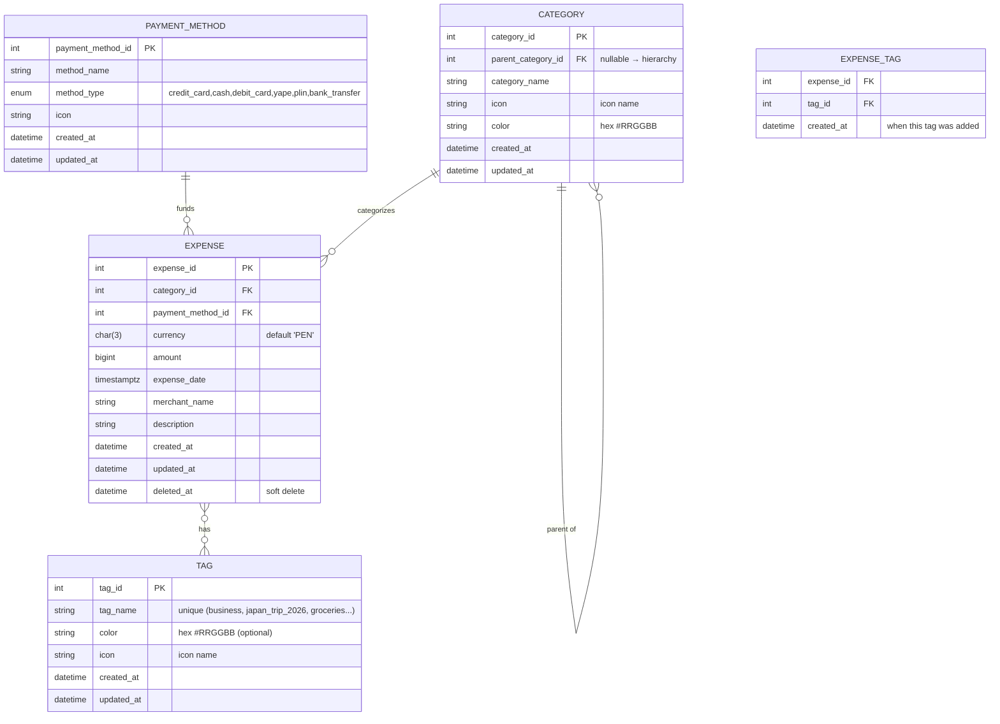

# Expenses registration

This program registers expenses

## Data model

## Icons used in this project

This project will use an open source icon library in the future, so the fields named icon should be string.

## Technologies used in this project

- PostgreSQL 18
- Go 1.26.2
- Echo v5
